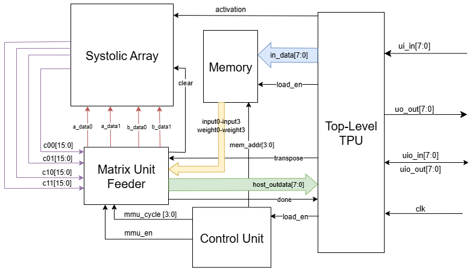

<!---

This file is used to generate your project datasheet. Please fill in the information below and delete any unused
sections.

You can also include images in this folder and reference them in the markdown. Each image must be less than
512 kb in size, and the combined size of all images must be less than 1 MB.
-->

## How it works

This project is a small-scale matrix multiplier inspired by the Tensor Processing Unit (TPU), an AI inference ASIC developed by Google.

It multiplies 2x2 matrices, each of which contain signed, 1-byte (8-bit) elements. It does so in a systolic array circuit, where flow of data is facilitated through the connections between a grid of 4 Multiply-Add-Accumulate (MAC) Processing Elements (PEs).

To store inputs prior to computation, it contains 2 matrices in memory registers, which occupy a total of 8 bytes.

To orchestrate the flow of data between inputs, memory, and outputs, a control unit coordinates state transitions, loads, and stores automatically.

Finally, to schedule the inputs and outputs to and from the systolic array, a feeder module closer to the matrix multiplier works with the control unit.

## System Architecture

Overall block diagram: 

### The Processing Element

|Signal Name        | Direction     | Blurb             |
|-------------------|---------------|-------------------|
|clk                | input         | The clock!        |
|rst                | input         | Reset             |
|clear              | input         | Clear PE          |
|a_in               | input         | First input       |
|a_out              | output        | Pass-on of input  |
|b_in               | input         | Weight value      |
|b_out              | output        | Pass-on of weight |
|c_out              | output        | Accumulation      |

Let's start from the most atomic element of the matrix multiplier unit (MMU): its processing element (PE). The value stored within each PE contributes an element to the output.

Since each output element of a matrix multiplication is a sum of products, the PE's primary operation is a multiply add accumulate.

It will taken in input terms `a_in` and `b_in`, multiply them, and then add them to an accumulator value `c_out`. Due to the larger values induced by multiplication, the accumulator holds more bits.

Since adjacent PEs corresponding to adjacent elements of the output matrix need the same input and weight values, these input terms are sent to `a_out` and `b_out` respectively, which are connected to other PEs by the systolic array.

Once the multiplication is done, the control unit will want to clear the PEs so that they can reset accumulation for the next matrix product, which is facilitated via the `clear` signal. 

On the other hand, it is non-ideal to reset the entire chip, as it wastes time (an entire clock cycle) and is overkill as it is unecessary to reset other elements.

### The Systolic Array

The systolic array is a network, or grid, of PEs. In this 2x2 multiplier, the result is a 4-element square matrix, so there are 4 PEs.

Internally, the systolic array maintains internal registers and a matrix of accumulators that are read by and written into by the PEs.

This includes a 2x3 matrix for the input matrix values, a 3x2 matrix for the weight matrix values, and a 2x2 for the final output.

The extra values beyond 2x2 for input & weight matrix values are to allow the PEs at the edge of the grid to send their input/weight values to a register to a "garbage".

At each clock cycle, elements will flow between the PEs. The inputs will flow from "left to right", and the weights will flow from "top to bottom". To add new values, inputs have to be provided to the ports at the "left", and weights have to be provided to the ports at the "top".

Then, the PEs are instantiated using compile-time construct of `genvar`, in which signals of the PE are connected to specified indices of the internal systolic array signals. Makes the code clean and easy to write!

Block Diagram...

### Unified Memory

|Signal Name        | Direction | Width | Description                           |
|-------------------|-----------|-------|---------------------------------------|
|clk                | input     | 1     | System clock                          |
|rst                | input     | 1     | Active-high reset                     |
|write_en           | input     | 1     | Enable signal for matrix loading      |
|addr               | input     | 3     | Memory address for matrix elements    |
|in_data            | input     | 8     | Current input matrix                  |
|weight[0,1,2,3]    | output    | 8     | Weight matrices                       |
|input[0,1,2,3]     | output    | 8     | Input matrices                        |

The unified memory module (`memory.v`) is a dedicated memory unit that stores input matrices (both general inputs and weights) for quick access to both values during computations. The unit supports synchronous writes and asynchronous reads.

### Control Unit

|Signal Name        | Direction | Width | Description                           |
|-------------------|-----------|-------|---------------------------------------|
|clk                | input     | 1     | System clock                          |
|rst                | input     | 1     | Active-high reset                     |
|load_en            | input     | 1     | Enable signal for matrix loading      |
|mem_addr           | output    | 3     | Memory address for matrix elements    |
|mmu_en             | output    | 1     | Enable signal for MMU operations      |
|mmu_cycle          | output    | 3     | Current cycle count for MMU timing    |

The control unit (`control_unit.v`) serves as the central orchestrator for the entire TPU, coordinating the flow of data between memory, the systolic array, and output collection through a carefully designed finite state machine (FSM).

**State Machine Architecture**

The control unit implements a 3-state FSM that manages the complete matrix multiplication pipeline:

1. **S_IDLE (2'b00)**: The default waiting state where the system remains until a matrix multiplication operation is requested via the `load_en` signal.

2. **S_LOAD_MATS (2'b01)**: The matrix loading phase where 8 matrix elements (4 for each 2x2 matrix) are sequentially loaded into memory. The control unit tracks progress using `mat_elems_loaded` counter and generates appropriate memory addresses.

3. **S_MMU_FEED_COMPUTE_WB (2'b10)**: The computation and output phase where the systolic array performs matrix multiplication and results are made available for collection.

**Orchestration Logic**

The control unit coordinates several critical functions:

**Memory Interface Management**: Through the `mem_addr` output (`control_unit.v:9`), it generates sequential memory addresses (0-7) during the loading phase, ensuring matrix elements are stored in the correct memory locations for later retrieval.

**MMU Timing Control**: The `mmu_cycle` signal (`control_unit.v:13`) provides precise timing information to the MMU feeder module, enabling it to:
- Feed correct matrix elements to the systolic array at appropriate cycles
- Determine when computation results are ready for output
- Clear processing elements after computation completion

**Pipeline Coordination**: The `mmu_en` signal (`control_unit.v:12`) acts as the master enable for the entire computation pipeline, transitioning from low during loading to high during computation phases.

**Critical Timing Relationships**

The control unit implements sophisticated timing logic based on the systolic array's computational pipeline:

- **Cycle 0**: Initial data feeding begins (a00×b00 starts)
- **Cycle 1**: First partial products computed, additional data fed
- **Cycle 2**: First result (c00) becomes available
- **Cycle 3**: Second and third results (c01, c10) become available simultaneously  
- **Cycle 4**: Final result (c11) becomes available
- **Cycle 5**: All outputs remain stable, then system returns to idle

**State Transition Logic**

State transitions are triggered by specific conditions:
- `S_IDLE → S_LOAD_MATS`: When `load_en` is asserted (`control_unit.v:30-32`)
- `S_LOAD_MATS → S_MMU_FEED_COMPUTE_WB`: When all 8 elements are loaded (`mat_elems_loaded == 3'b111`) (`control_unit.v:37-38`)
- `S_MMU_FEED_COMPUTE_WB → S_IDLE`: After 5 computation cycles (`mmu_cycle == 3'b101`) (`control_unit.v:52-53`)

**Integration with Other Modules**

The control unit interfaces with all major TPU components:
- **Memory Module**: Provides addressing (`mem_addr`) and coordinates write operations during loading
- **MMU Feeder**: Supplies enable signal (`mmu_en`) and cycle timing (`mmu_cycle`) for data routing and output selection
- **Top-level TPU**: Receives external `load_en` control signal and coordinates the entire operation sequence

This design ensures that matrix multiplication operations proceed automatically once initiated, with the control unit handling all timing dependencies and data flow coordination between the TPU's constituent modules.

### The Matrix Unit Feeder

The Matrix Unit Feeder (in `mmu_feeder.v`) is the middle-man module between the control unit and the computational unit (MMU), facilitating smooth data flow between the internal components of the TPU and outputs to the host. When enabled, its role is to either feed the expected matrix data from host --> mmu, or to direct computed matrix outputs from MMU --> host; this is decided based on the mmu_cycle defined by the control unit.

|Signal Name        | Direction | Width | Description                           |
|-------------------|-----------|-------|---------------------------------------|
|clk                | input     | 1     | System clock                          |
|rst                | input     | 1     | Active-high reset                     |
|en                 | input     | 1     | Enable signal for MMU operations      |
|mmu_cycle          | input     | 3     | Current cycle count for timing        |
|weight[0,1,2,3]    | input     | 8     | Weight matrix from memory             |
|input[0,1,2,3]     | input     | 8     | Input matrix from memory              |
|c[00,01,10,11]     | input     | 8     | Computed element output from MMU      |
|done               | output    | 1     | Signal to host that output is ready   |
|host_outdata       | output    | 8     | Data register to output to host       |
|a_data[0,1]        | output    | 8     | Output A to MMU for computation       |
|b_data[0,1]        | output    | 8     | Output B to MMU for computation       |

The weight and input matrices are taken from memory. The feeder will set the expected values of a_data0/1 and b_data0/1 depending on the value of mmu_cycle. During cycles 2-5, host_outdata is set to computed values from the MMU:
- **Cycle 0**: host_outdata = xxx, a_data0 = weight[0], b_data0 = input[0], done = 0
- **Cycle 1**: host_outdata = xxx, a_data0 = weight[1], a_data1 = weight[2], b_data0 = input[2], b_data1 = input[1], done = 0
- **Cycle 2**: host_outdata = c00, a_data1 = weight[3], b_data1 = input[3], done = 1
- **Cycle 3**: host_outdata = c01, done = 1
- **Cycle 4**: host_outdata = c10, done = 1
- **Cycle 5**: host_outdata = c11, done = 1, feeder goes idle until next round of inputs & computations

For more details on timing relationships, see **Critical Timing Relationships** above, in the Control Unit section.

## How to test

Notation: the matrix element A_xy denotes a value in the xth row and yth column of the matrix A.

The module will assume an order of input of A matrix values and B matrix values, and outputs. That is, it is expected that inputs come in order of A00, A01, A10, A11, B00, B01, B10, B11, and the outputs will come in the order of C00, C01, C10, C11. This keeps it simple.

### Setup

1. Power Supply: Connect the chip to a stable power supply as per the voltage specifications.
2. Clock Signal: Provide a stable clock signal to the clk pin.
3. Reset: Ensure the rst_n pin is properly connected to allow resetting the chip.

### A Matrix Multiplication Round

1. Initial Reset
    - Perform a reset by pulling the `rst_n` pin low to 0, and waiting for a single clock signal before pulling it back high to 1. This sets initial state values.
2. Initial Matrix Load
    - Load 8 matrix elements into the chip, one per cycle. For example, if your matrices are [[1, 2], [3, 4]], [[5, 6], [7, 8]], you would load in the row-major, first-matrix-first order of 1, 2, 3, 4, 5, 6, 7, 8. This occurs by setting the 8 `ui_in` pins to the 8-bit value of the set matrix element, and waiting one clock cycle before the next can be loaded.
3. Collect Output
    - Thanks to the aggressive pipelining implemented in the chip, once the matrices are already loaded, you can start collecting output!
    - Output elements will come one per cycle. So you would wait for a single clock edge, and then read the `uo_out` pin for the 8-bit output value. At the next clock edge, the value of `uo_out` will change to the next element in the order of c_00, c_01, c_10, c_11.
    - For the above example, the output would be in the order of [19, 22, 43, 50], starting from the cycle right after you finish your last load.
4. Repeat
    - Load 8 more input values, collect 4 outputs, rinse & repeat!

## External hardware

An external microcontroller will send signals over the chip interface, including the clock signal, which will alow it to coordinate I/O on clock edges.

## Acknowledgements
* William Zhang: Processing Elements, Systolic Array, General Design/Sythesis, Pipelining
* Ethan Leung: Matrix Unit Feeder
* Guhan Iyer: Unified Memory
* Yash Karthik: Control Unit
* ECE 298A Course Staff: Prof. John Long, Prof. Vincent Gaudet, Refik Yalcin
